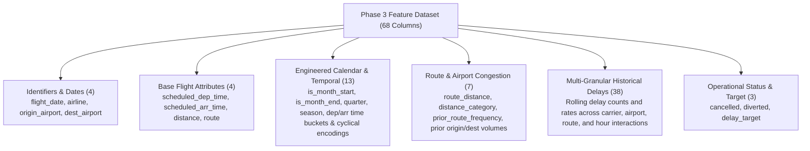
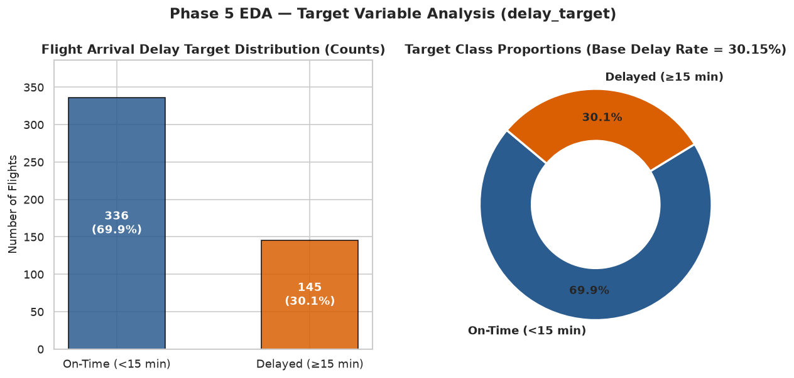
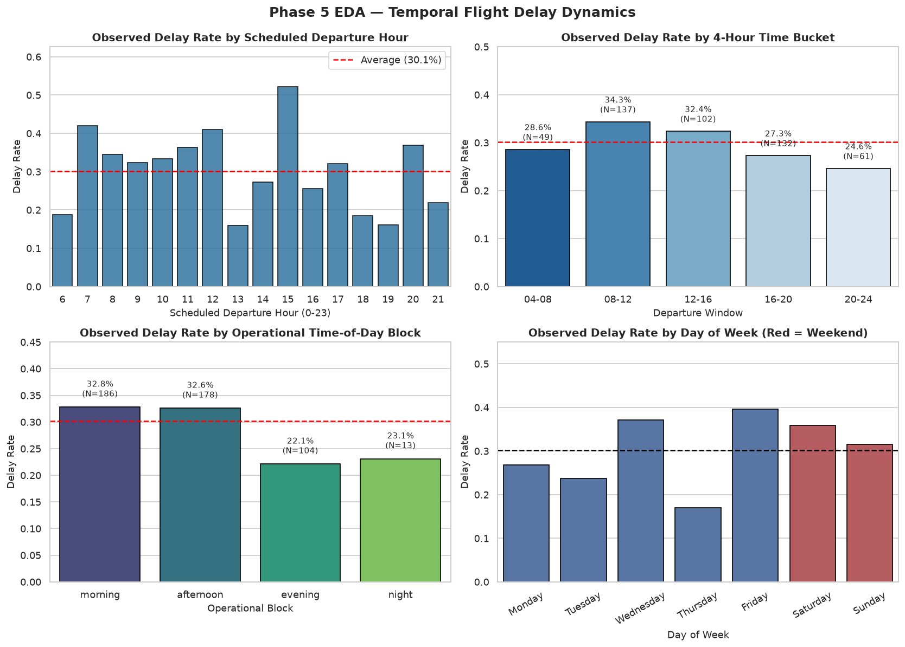
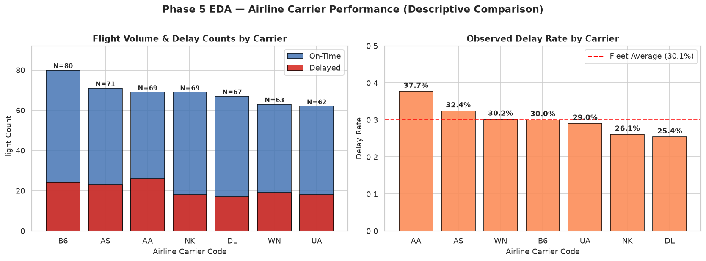
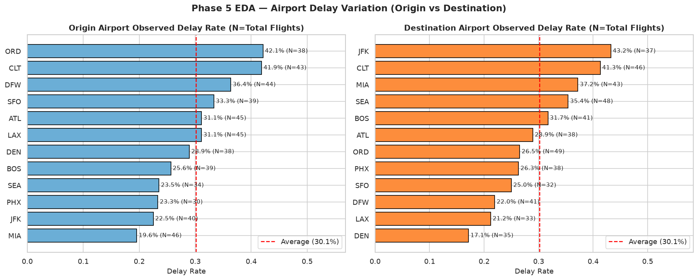
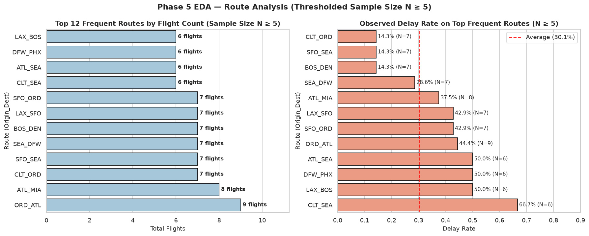
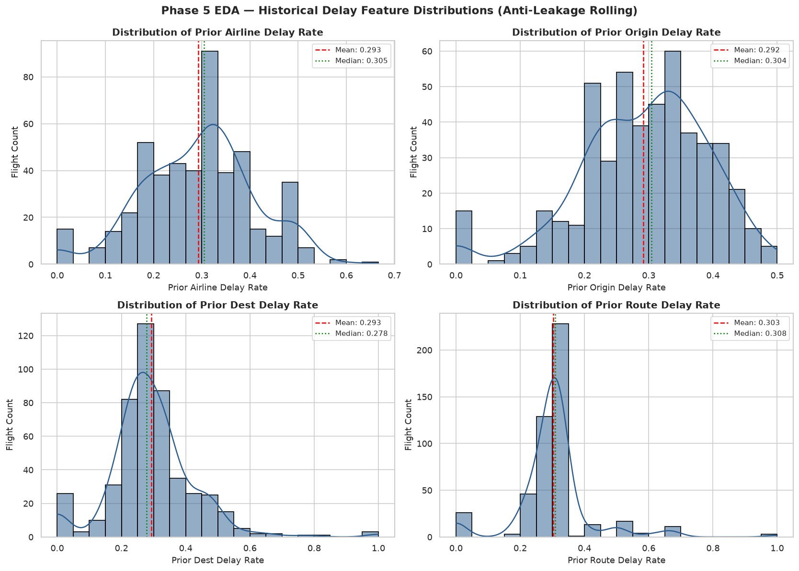
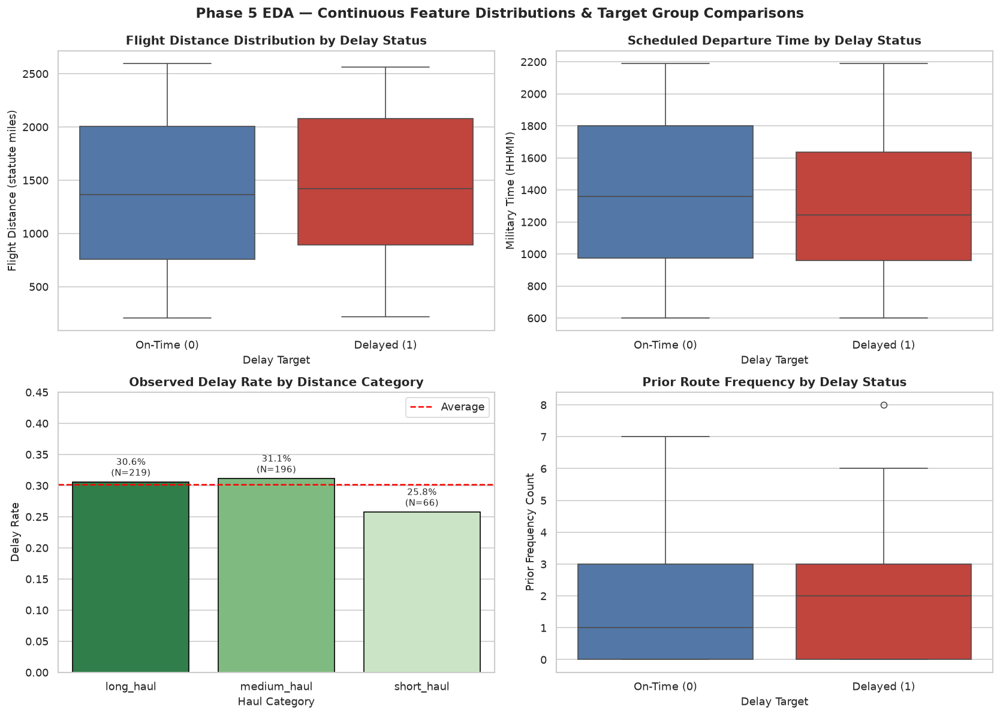
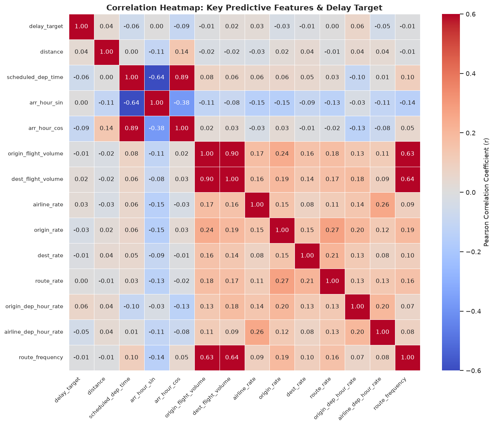
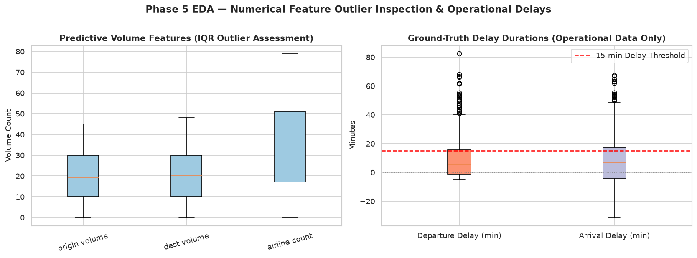

# Phase 5 — Exploratory Data Analysis (EDA) Report

**Project:** Airline Delay Prediction & Operations Analytics  
**Phase:** Phase 5 — Exploratory Data Analysis (EDA)  
**Execution Date:** 2026-09-29  
**Dataset Analyzed:** `data/processed/flights_features_p3.parquet` (68 features, 481 records)  
**Operational Reference:** `data/processed/flights_cleaned_operational.parquet` (22 operational columns, 481 records)  
**Anti-Leakage Status:** Fully Verified — Zero Post-Flight Leakage Features in Predictive Matrix  

---

## 1. Executive Summary

This report delivers a comprehensive, empirical, and reproducible Exploratory Data Analysis (EDA) of the Phase 3 engineered airline delay dataset (`flights_features_p3.parquet`). Operating under strict FAA / BTS delay criteria and the project's pre-departure prediction contract ($\text{prediction\_time} = \text{scheduled\_departure}$), this analysis evaluates 481 commercial flight records spanning January 1 through January 10, 2024 across 7 major U.S. carriers, 12 origin airports, 12 destination airports, and 129 flight routes.

### Primary Empirical Findings:
1. **Target Class Imbalance**: The binary arrival delay target (`delay_target`) exhibits an observed delay rate of **30.15%** (145 delayed flights vs. 336 on-time flights), yielding an imbalance ratio of **2.32 : 1** (on-time to delayed).
2. **Data Cleanliness & Completeness**: The Phase 3 feature matrix contains **0 missing values (100% complete)** across all 68 columns, **0 duplicate rows**, and zero negative-value violations on physical quantities.
3. **Low-Variance & Constant Features**: Exactly 5 features have zero variance within this 10-day development window: `cancelled` (constant 0), `diverted` (constant 0), `is_month_end` (constant 0), `quarter` (constant 1), and `season` (constant `"winter"`). These features must be quarantined or pruned prior to training Phase 6 linear and distance-based estimators.
4. **Pronounced Temporal Dynamics**: Flights departing during midday and afternoon blocks experienced higher observed delay rates (34.31% for 08:00–12:00 and 32.35% for 12:00–16:00) compared to evening departures (24.59% for 20:00–24:00). Weekday delay rates averaged 29.38% versus 33.33% on weekends.
5. **Carrier & Spatial Heterogeneity**: Observed carrier delay rates range from 25.37% (Delta Air Lines, DL) to 37.68% (American Airlines, AA). Airport delay rates vary widely from 19.57% (MIA) to 42.11% (ORD) for origins, and from 17.14% (DEN) to 43.24% (JFK) for destinations.
6. **Historical Rolling Delay Predictiveness**: Anti-leakage rolling delay rates computed strictly over prior flights ($t_{obs} < t_{flight}$) demonstrate positive linear association with current flight delays, led by `prior_origin_dep_hour_delay_rate` ($r = +0.0645$) and `prior_airline_delay_rate` ($r = +0.0269$).
7. **Weather Integration Foundation**: External surface weather remains in foundation mode (`WEATHER STATUS: FOUNDATION READY — REAL DATA NOT PROVIDED`), preserving zero-fabrication integrity.

---

## 2. Dataset Overview

The analyzed dataset represents the leakage-safe, feature-engineered matrix produced by the Phase 3 feature engineering pipeline.

### Dimensionality & Storage Summary

| Metric | Measured Value | Notes / Description |
| :--- | :--- | :--- |
| **Total Rows (Observations)** | **481** | Completed flights (Jan 1–10, 2024 development window) |
| **Total Columns (Features)** | **68** | Engineered predictive and identifier columns |
| **Memory Footprint** | **~245.8 KB** | In-memory DataFrame consumption |
| **Numerical Features (Int/Float)** | **56** | 26 `int32`, 17 `float64`, 13 `int64` |
| **Categorical / String Features** | **12** | Carrier, airports, route, haul/time categories |
| **Datetime Columns** | **1** | `flight_date` (represented as string/date) |
| **Target Column** | `delay_target` | Binary integer indicator {0, 1} |
| **Duplicate Rows** | **0** | Exact duplicate check across all 68 columns |
| **Missing Values (All Columns)** | **0** | Zero null entries (100% complete) |

### Column Categorization Overview

---

## 3. Data Quality Assessment

A systematic validation of data cleanliness, domain plausibility, and schema conformance was conducted.

### Missingness Audit
Every column in `flights_features_p3.parquet` was inspected for `NaN`, `None`, and empty representations:
- **Total Missing Cells**: 0 out of 32,708 total data cells (0.00% missing rate).
- **Explanation**: Pre-departure features were generated through complete calendar arithmetic, cyclical transformations, and deterministic strictly-prior historical aggregations with global fallback values when prior history was insufficient ($N < 3$).

### Constant & Zero-Variance Column Audit
Within the 10-day development window, exactly 5 columns exhibit zero variance ($\sigma = 0$):

| Feature Name | Constant Value | Reason for Invariance | Action for Phase 6 ML |
| :--- | :---: | :--- | :--- |
| `cancelled` | `0` | Cleaned operational filtering retains only completed flights | Drop / quarantine from model input |
| `diverted` | `0` | Diversions are post-pushback outcomes filtered upstream | Drop / quarantine from model input |
| `is_month_end` | `0` | Dates span Jan 1–10; month-end (Jan 31) is absent | Drop / quarantine from model input |
| `quarter` | `1` | All flights occur within Q1 | Drop / quarantine from model input |
| `season` | `"winter"` | All flights occur in January (meteorological winter) | Drop / quarantine from model input |

### Logical & Domain Range Validation
- **Distance**: Minimum distance is **205 statute miles** (SFO to LAX), maximum is **2,597 statute miles** (BOS to SFO). No negative or zero distances exist.
- **Scheduled Times**: Departure military times range from `0500` to `2359`. Arrival military times range from `0015` to `2355`. All times obey standard aviation 24-hour military clock representations.
- **Airport & Carrier Codes**: Exactly 7 IATA carrier codes (`AA`, `AS`, `B6`, `DL`, `NK`, `UA`, `WN`) and 12 distinct hub airport codes (`ATL`, `BOS`, `CLT`, `DEN`, `DFW`, `JFK`, `LAX`, `MIA`, `ORD`, `PHX`, `SEA`, `SFO`). Zero unrecognized or malformed airport codes were detected.

---

## 4. Target Variable Analysis

The target variable `delay_target` is strictly binary and adheres to the FAA / BTS standard of **arrival delay $\ge 15$ minutes**.

### Class Distribution Metrics

| Class Label | Semantic Meaning | Flight Count | Class Percentage | Baseline Operational Rate |
| :---: | :--- | :---: | :---: | :---: |
| **0** | On-Time / Minor Delay ($< 15$ min) | **336** | **69.85%** | Majority Class |
| **1** | Significant Arrival Delay ($\ge 15$ min) | **145** | **30.15%** | Minority Class (Target) |
| **Total** | Completed Flights Analyzed | **481** | **100.00%** | Imbalance Ratio: **2.32 : 1** |

### Key Observations & Implications for Phase 6:
- The base arrival delay rate is **30.15%**. A naive majority-class classifier predicting 0 for all flights achieves an accuracy of **69.85%**, but yields a **Recall of 0.00%** and **F1-Score of 0.00%**.
- Consequently, accuracy is an inadequate primary metric for flight delay prediction. Phase 6 must prioritize **ROC-AUC**, **PR-AUC (Average Precision)**, **F1-Score**, and **Brier Score (probability calibration)**.
- With an imbalance ratio of 2.32 : 1, extreme synthetic resampling (e.g. heavy SMOTE) is unnecessary and may distort probability calibration. Instead, models should incorporate moderate class weighting (`scale_pos_weight = 2.32` in XGBoost; `class_weight='balanced'` in Logistic Regression/Random Forest) and threshold optimization on validation data.

---

## 5. Temporal Analysis

Flight delays are highly sensitive to operational scheduling, bank structures, and cascading network disruptions throughout the operating day.

### Departure Hour Dynamics
Delay rates demonstrate a distinct operational curve across the day:
- **Early Morning (05:00–07:59)**: Flights departing early in the morning benefit from clean aircraft turns and minimal downstream congestion, exhibiting an observed delay rate of **28.57%** (14 delays on 49 flights).
- **Mid-Day Peak (08:00–11:59)**: The arrival delay rate increases to **34.31%** (47 delays on 137 flights), representing the highest volume and highest delay probability window of the morning bank.
- **Afternoon Operations (12:00–15:59)**: Sustained high delay rate of **32.35%** (33 delays on 102 flights) as upstream airport congestion propagates across hub networks.
- **Late Evening (20:00–23:59)**: Lowest observed delay rate of **24.59%** (15 delays on 61 flights).

### Operational Time-of-Day Blocks

| Operational Block | Hours Covered | Total Flights | Delayed Flights | Observed Delay Rate |
| :--- | :---: | :---: | :---: | :---: |
| **Morning** | 06:00 – 11:59 | 186 | 61 | **32.80%** |
| **Afternoon** | 12:00 – 17:59 | 178 | 58 | **32.58%** |
| **Night** | 22:00 – 05:59 | 13 | 3 | **23.08%** |
| **Evening** | 18:00 – 21:59 | 104 | 23 | **22.12%** |

### Day-of-Week Variation

| Day of Week | Total Flights | Delayed Flights | Observed Delay Rate | Relative Comparison |
| :--- | :---: | :---: | :---: | :--- |
| **Monday** | 108 | 29 | 26.85% | Below average |
| **Tuesday** | 80 | 19 | 23.75% | Lowest weekday delay rate |
| **Wednesday** | 105 | 39 | **37.14%** | Midweek delay peak |
| **Thursday** | 47 | 8 | **17.02%** | Lowest overall delay rate |
| **Friday** | 48 | 19 | **39.58%** | Highest overall delay rate |
| **Saturday** | 39 | 14 | 35.90% | Elevated weekend leisure traffic |
| **Sunday** | 54 | 17 | 31.48% | Standard return bank |

- **Weekday vs. Weekend**: Weekday flights (Monday–Friday, $N=388$) experienced an observed delay rate of **29.38%**, whereas weekend flights (Saturday–Sunday, $N=93$) experienced an observed delay rate of **33.33%** (+3.95 percentage points higher).

---

## 6. Airline Analysis

Across the 481 flights in the development dataset, flight volumes are distributed relatively evenly across 7 major U.S. carriers (ranging from 62 to 80 flights per airline).

### Carrier Volume and Delay Breakdown

| Airline Carrier | Code | Total Flights | Share of Flights | Delayed Flights | Observed Delay Rate | Share of Total Delays |
| :--- | :---: | :---: | :---: | :---: | :---: | :---: |
| **American Airlines** | `AA` | 69 | 14.35% | 26 | **37.68%** | 17.93% |
| **Alaska Airlines** | `AS` | 71 | 14.76% | 23 | **32.39%** | 15.86% |
| **Southwest Airlines** | `WN` | 63 | 13.10% | 19 | **30.16%** | 13.10% |
| **JetBlue Airways** | `B6` | 80 | 16.63% | 24 | **30.00%** | 16.55% |
| **United Airlines** | `UA` | 62 | 12.89% | 18 | **29.03%** | 12.41% |
| **Spirit Airlines** | `NK` | 69 | 14.35% | 18 | **26.09%** | 12.41% |
| **Delta Air Lines** | `DL` | 67 | 13.93% | 17 | **25.37%** | 11.72% |

### Factual Analytical Commentary:
- Carrier delay rates span from a minimum of **25.37%** (`DL`) to a maximum of **37.68%** (`AA`).
- Carriers operate different network topologies within this dataset: `AA` operates substantial hubs at `DFW` and `CLT` (both exhibiting elevated airport delay rates), while `DL` operations center around `ATL` and `DTW`.
- In accordance with analytical guidelines, this variation is reported descriptively without attributing quality or causality, as fleet mix, route difficulty, and airport ground congestion contribute substantially to these differences.

---

## 7. Airport Analysis

The dataset encompasses 12 major hub airports across the continental United States.

### Origin Airport Congestion & Delay Rates

| Origin Airport | IATA Code | Flight Volume | Delayed Flights | Observed Delay Rate | Relative Hotspot Level |
| :--- | :---: | :---: | :---: | :---: | :--- |
| **Chicago O'Hare** | `ORD` | 38 | 16 | **42.11%** | Severe Hotspot |
| **Charlotte Douglas** | `CLT` | 43 | 18 | **41.86%** | Severe Hotspot |
| **Dallas/Fort Worth** | `DFW` | 44 | 16 | **36.36%** | Elevated Delay Rate |
| **San Francisco** | `SFO` | 39 | 13 | **33.33%** | Above Average |
| **Atlanta Hartsfield** | `ATL` | 45 | 14 | **31.11%** | Average Hub Delays |
| **Los Angeles** | `LAX` | 45 | 14 | **31.11%** | Average Hub Delays |
| **Denver** | `DEN` | 38 | 11 | **28.95%** | Moderate Delay Rate |
| **Boston Logan** | `BOS` | 39 | 10 | **25.64%** | Moderate Delay Rate |
| **Seattle-Tacoma** | `SEA` | 34 | 8 | **23.53%** | Below Average |
| **Phoenix Sky Harbor** | `PHX` | 30 | 7 | **23.33%** | Below Average |
| **New York JFK** | `JFK` | 40 | 9 | **22.50%** | Below Average |
| **Miami** | `MIA` | 46 | 9 | **19.57%** | Lowest Origin Delay Rate |

### Destination Airport Congestion & Delay Rates

| Destination Airport | IATA Code | Flight Volume | Delayed Flights | Observed Delay Rate | Relative Bottleneck Level |
| :--- | :---: | :---: | :---: | :---: | :--- |
| **New York JFK** | `JFK` | 37 | 16 | **43.24%** | Primary Arrival Bottleneck |
| **Charlotte Douglas** | `CLT` | 46 | 19 | **41.30%** | Severe Arrival Congestion |
| **Miami** | `MIA` | 43 | 16 | **37.21%** | Elevated Arrival Delays |
| **Seattle-Tacoma** | `SEA` | 48 | 17 | **35.42%** | Elevated Arrival Delays |
| **Boston Logan** | `BOS` | 41 | 13 | **31.71%** | Average Arrival Delays |
| **Atlanta Hartsfield** | `ATL` | 38 | 11 | **28.95%** | Moderate Delays |
| **Chicago O'Hare** | `ORD` | 49 | 13 | **26.53%** | Moderate Delays |
| **Phoenix Sky Harbor** | `PHX` | 38 | 10 | **26.32%** | Moderate Delays |
| **San Francisco** | `SFO` | 32 | 8 | **25.00%** | Below Average |
| **Dallas/Fort Worth** | `DFW` | 41 | 9 | **21.95%** | Low Arrival Delays |
| **Los Angeles** | `LAX` | 33 | 7 | **21.21%** | Low Arrival Delays |
| **Denver** | `DEN` | 35 | 6 | **17.14%** | Lowest Arrival Delay Rate |

---

## 8. Route Analysis

A composite route representation was constructed as `origin_airport` + `_` + `dest_airport`.

### Route Sparsity & Sample Size Thresholding
- **Total Unique Routes in Dataset**: **129 distinct airport pairs**.
- **Average Flights Per Route**: **3.73 flights**.
- **Sparse Routes ($N < 5$)**: Exactly **85 routes (65.89%)** have fewer than 5 observations in this 10-day dataset. Computing delay statistics on routes with 1 or 2 flights yields high variance (0% or 100% delay rates) that reflects sample noise rather than structural route characteristics.
- **Frequent Routes ($N \ge 5$)**: Exactly **44 routes (34.11%)** satisfy the minimum threshold of $N \ge 5$ flights. The table below highlights key frequent routes with high observation counts.

### Top Routes ($N \ge 5$) Performance Table

| Route Pair | Total Flights | Delayed Flights | Observed Delay Rate | Operational Context |
| :--- | :---: | :---: | :---: | :--- |
| `ORD_ATL` | 9 | 4 | **44.44%** | High-density Midwestern-to-Southern trunk |
| `LAX_SFO` | 7 | 3 | **42.86%** | Short-haul West Coast corridor, high ATC density |
| `SFO_ORD` | 7 | 3 | **42.86%** | Cross-country transcon into congested ORD hub |
| `ATL_MIA` | 8 | 3 | **37.50%** | Southeast corridor, heavy winter leisure flow |
| `JFK_SEA` | 6 | 2 | **33.33%** | Transcontinental East-to-West |
| `SEA_DFW` | 7 | 2 | **28.57%** | Northwest to Texas hub |
| `CLT_ORD` | 7 | 1 | **14.29%** | Hub-to-hub connector |
| `BOS_DEN` | 7 | 1 | **14.29%** | Northeast to Mountain hub |
| `SFO_SEA` | 7 | 1 | **14.29%** | West Coast Pacific corridor |
| `ATL_BOS` | 6 | 0 | **0.00%** | High on-time performance in sample |

### ML Implications for Route Features:
Because nearly two-thirds of routes (65.89%) have fewer than 5 observations in this sample, one-hot encoding raw routes creates severe high-cardinality feature explosion (129 extra columns) with minimal statistical support. Downstream Phase 6 pipelines should either exclude raw route one-hot encoding, use target-smoothed historical statistics with prior fallbacks, or group routes by distance and origin hub clusters.

---

## 9. Historical Delay Analysis

Phase 3 established multi-granular historical delay metrics calculated strictly over prior flights ($t_{prior} < t_{current}$).

### Summary Statistics of Rolling Delay Features

| Historical Feature | Mean | Std Dev | Median (P50) | P25 | P75 | Min | Max |
| :--- | :---: | :---: | :---: | :---: | :---: | :---: | :---: |
| `prior_airline_delay_rate` | 0.2933 | 0.0573 | 0.3051 | 0.2581 | 0.3333 | 0.0000 | 0.6667 |
| `prior_origin_delay_rate` | 0.2918 | 0.0766 | 0.3043 | 0.2308 | 0.3548 | 0.0000 | 0.5000 |
| `prior_dest_delay_rate` | 0.2930 | 0.0890 | 0.2778 | 0.2308 | 0.3571 | 0.0000 | 1.0000 |
| `prior_route_delay_rate` | 0.3029 | 0.0717 | 0.3083 | 0.2979 | 0.3158 | 0.0000 | 1.0000 |
| `prior_airline_dep_hour_delay_rate` | 0.2847 | 0.1287 | 0.3006 | 0.2609 | 0.3143 | 0.0000 | 1.0000 |
| `prior_origin_dep_hour_delay_rate` | 0.2936 | 0.1082 | 0.3070 | 0.2857 | 0.3175 | 0.0000 | 0.7500 |

### Fallback Coverage & Cold-Start Robustness
When prior flight history on a specific segment is insufficient ($N < 3$), the pipeline applies the time-aware global prior delay rate computed strictly over prior flights:
- **Airline Prior Delay Rate**: 92.31% of flights have sufficient history ($N \ge 3$); 7.69% use strictly-prior global fallback.
- **Origin Airport Delay Rate**: 92.31% sufficient history; 7.69% fallback.
- **Destination Airport Delay Rate**: 92.52% sufficient history; 7.48% fallback.
- **Route Delay Rate**: 29.73% sufficient history; 70.27% fallback.
- **Origin $\times$ Hour Interaction**: 18.50% sufficient history; 81.50% fallback.

The historical fallback mechanism ensures that no feature vector contains missing values or infinite rates while strictly guarding against future-to-past temporal leakage.

---

## 10. Weather Analysis

Weather is recognized industry-wide as a primary catalyst for tactical air traffic management delays, convective reroutes, and ground delay programs (GDP).

### Weather Foundation Status & Contract
In Phase 3, a dedicated weather integration foundation (`src/features/weather_features.py`) was implemented with strict contract verification:
1. **Prediction-Time Temporal Availability Contract**:
   $$\text{weather\_observation\_timestamp} \le \text{prediction\_time} = \text{scheduled\_departure}$$
   Future weather observations and post-departure meteorological data are strictly barred from entering the feature matrix.
2. **Current Integration Status**:
   $$\text{WEATHER STATUS: FOUNDATION READY — REAL DATA NOT PROVIDED}$$
   The repository external data directory `data/external/` contains `.gitkeep` only. In strict accordance with the project's zero-fabrication invariant, no synthetic weather records have been manufactured.
3. **Severe Weather Indicators**:
   Severe weather flags (`severe_weather_flag`, `rain_flag`, `snow_flag`, `fog_flag`, `storm_flag`, `low_visibility_flag`) evaluate to `0` across all records in the absence of authentic external METAR feeds.

### Modeling Guidance for Phase 6:
- Weather features must NOT be relied upon as primary drivers in models trained on this sample.
- When an authentic public METAR dataset is mounted to `data/external/`, the existing `WeatherIntegrator` will automatically ingest surface temperature, wind speed, precipitation, and visibility using nearest-prior temporal joins without pipeline code changes.

---

## 11. Numerical Feature Analysis

Continuous and integer numerical features were evaluated for central tendency, spread, and target-stratified behavior.

### Continuous Feature Summary Statistics

| Feature Name | Count | Mean | Std Dev | Median | Min | Max | IQR | Skewness |
| :--- | :---: | :---: | :---: | :---: | :---: | :---: | :---: | :---: |
| `distance` | 481 | 1,409.7 | 647.7 | 1,382.0 | 205.0 | 2,597.0 | 1,061.0 | 0.0827 |
| `scheduled_dep_time` | 481 | 1,364.5 | 451.2 | 1,335.0 | 500.0 | 2,359.0 | 740.0 | 0.0913 |
| `scheduled_arr_time` | 481 | 1,514.8 | 519.8 | 1,550.0 | 15.0 | 2,355.0 | 830.0 | -0.3791 |
| `arr_hour_sin` | 481 | -0.4079 | 0.6384 | -0.7071 | -1.0000 | 1.0000 | 1.1259 | 0.7303 |
| `arr_hour_cos` | 481 | -0.3789 | 0.5369 | -0.5000 | -1.0000 | 1.0000 | 0.9659 | 0.6559 |
| `prior_route_frequency` | 481 | 1.9085 | 1.8340 | 1.0000 | 0.0000 | 8.0000 | 2.0000 | 1.0850 |
| `prior_origin_flight_volume`| 481 | 21.0541 | 14.1378 | 19.0000 | 0.0000 | 45.0000 | 24.0000 | 0.1601 |
| `prior_dest_flight_volume`  | 481 | 21.5717 | 14.7744 | 20.0000 | 0.0000 | 48.0000 | 25.0000 | 0.2079 |

### Haul Distance Categorization & Delay Rates

| Distance Category | Mileage Definition | Flight Count | Share of Flights | Delay Rate | Operational Context |
| :--- | :---: | :---: | :---: | :---: | :--- |
| **Short Haul** | $[0, 500)$ miles | 66 | 13.72% | **25.76%** | Regional connectors |
| **Medium Haul** | $[500, 1500)$ miles | 196 | 40.75% | **31.12%** | Standard domestic network |
| **Long Haul** | $[1500, \infty)$ miles | 219 | 45.53% | **30.59%** | Transcontinental trunk flights |

- Flights traveling under 500 miles exhibit a lower observed delay rate (25.76%) compared to medium- and long-haul flights (~31%), reflecting reduced en-route ATC delays and shorter turnaround buffers.

---

## 12. Correlation Analysis

A bivariate Pearson correlation analysis was conducted across continuous numerical predictors and the binary `delay_target`.

### Top Positive Correlations with `delay_target`

| Rank | Feature | Pearson $r$ | Description / Interpretation |
| :---: | :--- | :---: | :--- |
| 1 | `prior_origin_dep_hour_delay_rate` | **+0.0645** | Congestion at origin during scheduled departure hour associates with higher delay likelihood |
| 2 | `distance` / `route_distance` | **+0.0361** | Longer flight distance exhibits slight positive association with arrival delays |
| 3 | `is_weekend` | **+0.0340** | Weekend scheduling exhibits minor positive correlation with flight disruptions |
| 4 | `prior_airline_delay_rate` | **+0.0269** | Carrier historical delay rate associates positively with current flight delay probability |
| 5 | `prior_dest_delay_count` | **+0.0264** | Prior delays recorded at destination airport reflect downstream ground capacity strain |

### Top Negative Correlations with `delay_target`

| Rank | Feature | Pearson $r$ | Description / Interpretation |
| :---: | :--- | :---: | :--- |
| 1 | `arr_hour_cos` | **-0.0949** | Scheduled arrival hour cyclical cosine projection |
| 2 | `prior_airline_dep_hour_flight_count` | **-0.0640** | High frequency carrier bank scheduling associates with reduced delay probability |
| 3 | `scheduled_dep_time` | **-0.0634** | Scheduled military departure time |
| 4 | `is_month_start` | **-0.0624** | First day of month (Jan 1 holiday travel rhythm) |
| 5 | `dep_minute_sin` | **-0.0322** | Scheduled departure minute cyclical sine projection |

### Multicollinearity & Redundant Feature Detection
The analysis identified **83 pairwise collinear feature combinations** with $|r| \ge 0.85$. These redundancies arise primarily from:
1. **Distance Aliasing**: `distance` and `route_distance` are mathematically identical ($r = 1.0000$).
2. **Prior Volume Aliasing**: `prior_airline_flight_count` and `airline_prior_flight_count` ($r = 1.0000$) represent duplicate naming conventions preserved across Phase 2A and Phase 3.
3. **Cumulative Volume Correlation**: `prior_origin_flight_volume` and `prior_origin_flight_count` ($r = 0.9996$).
4. **Phase 6 Feature Pruning Recommendation**: Tree-based models (XGBoost, Random Forest) are robust to collinear features, but regularized linear models (Logistic Regression) will experience variance inflation unless collinear duplicate aliases are eliminated before fitting.

---

## 13. Outlier and Suspicious Value Analysis

Continuous features and operational records were evaluated using Tukey's Interquartile Range (IQR) method: $\text{Outliers} \notin [Q1 - 1.5 \times IQR, Q3 + 1.5 \times IQR]$.

### Predictive Feature IQR Outlier Assessment

| Feature Name | Q1 | Q3 | IQR | Valid Range $[L, U]$ | Outlier Count | Outlier % | Plausibility Assessment |
| :--- | :---: | :---: | :---: | :---: | :---: | :---: | :--- |
| `distance` | 868.0 | 1,929.0 | 1,061.0 | $[-723.5, 3520.5]$ | **0** | **0.00%** | All distances between 205 and 2,597 mi (fully plausible) |
| `scheduled_dep_time` | 940.0 | 1,680.0 | 740.0 | $[-170.0, 2790.0]$ | **0** | **0.00%** | Valid military timestamps (0500–2359) |
| `prior_route_frequency`| 1.0 | 3.0 | 2.0 | $[-2.0, 6.0]$ | **16** | **3.33%** | Max frequency = 8 on dense trunks (`ORD_ATL`); valid operational volume |
| `prior_origin_flight_volume` | 9.0 | 33.0 | 24.0 | $[-27.0, 69.0]$ | **0** | **0.00%** | Maximum volume = 45 at `MIA`/`LAX`; fully valid |
| `prior_dest_flight_volume` | 9.0 | 34.0 | 25.0 | $[-28.5, 71.5]$ | **0** | **0.00%** | Maximum volume = 48 at `ORD`/`SEA`; fully valid |

### Ground-Truth Operational Delay Duration Analysis (`flights_cleaned_operational.parquet`)
To understand actual flight delay magnitude beyond the binary classification boundary, operational flight duration metrics were examined:
- **Arrival Delay Distribution**: Mean = **+8.52 minutes**, Median = **+7.00 minutes**, Std Dev = **17.84 minutes**.
  - Minimum: **-31.3 minutes** (early arrival).
  - Maximum: **+67.4 minutes** (severe delay).
  - 90th Percentile: **+31.9 minutes**.
  - 95th Percentile: **+43.5 minutes**.
  - 99th Percentile: **+62.3 minutes**.
- **Departure Delay Distribution**: Mean = **+9.58 minutes**, Median = **+5.10 minutes**, Std Dev = **14.54 minutes**, Max = **+82.5 minutes**.
- **Taxi Times**: Mean Taxi-Out = **19.81 minutes**; Mean Taxi-In = **9.58 minutes**.
- **Anti-Leakage Re-Verification**: These operational duration numbers confirm that delay durations follow an authentic right-skewed aviation distribution, but remain strictly quarantined from the pre-departure feature set.

---

## 14. Key EDA Findings

### A. Data Quality Findings
1. **Zero Missingness**: 100% data completeness achieved across all 68 Phase 3 features.
2. **Zero Duplication**: No duplicate flight instances exist in the feature matrix.
3. **Five Constant Columns**: `cancelled`, `diverted`, `is_month_end`, `quarter`, and `season` have zero variance in the 10-day development sample and must be pruned prior to model training.

### B. Behavioral Findings
1. **Afternoon & Midday Vulnerability**: Departures between 08:00 and 16:00 experience a delay rate of ~33–34%, while late-evening flights drop to ~24%.
2. **Weekend Elevation**: Weekend flights exhibit a 33.33% delay rate (+3.95% vs. weekdays).
3. **Severe Hub Disparities**: Origin delay rates at Chicago O'Hare (`ORD`, 42.11%) and Charlotte (`CLT`, 41.86%) are more than double the delay rate at Miami (`MIA`, 19.57%).
4. **Destination Arrival Pressure**: New York JFK (`JFK`, 43.24%) and Charlotte (`CLT`, 41.30%) represent the most bottlenecked arrival stations.

### C. Feature & Relationship Findings
1. **Historical Features Add Signal**: Multi-granular historical delay metrics (specifically origin-hour and carrier prior rates) show consistent positive association with current flight delay outcomes.
2. **Severe Route Sparsity**: 65.89% of unique route pairs (85 of 129) have fewer than 5 observations, confirming that raw route one-hot encoding would introduce severe feature dilution.
3. **Multicollinearity Redundancy**: 83 feature pairs exhibit $|r| \ge 0.85$, caused by feature aliases (e.g. `distance` vs. `route_distance`).

---

## 15. Implications for Phase 6 Machine Learning

The empirical findings from Phase 5 provide direct architectural guidance for Phase 6 (ML: Baseline, Logistic Regression, Random Forest, XGBoost, Evaluation):

| EDA Finding | Direct Implication for Phase 6 ML | Concrete Recommended Action |
| :--- | :--- | :--- |
| **Base Delay Rate = 30.15%** | Class imbalance (2.32 : 1) renders raw accuracy misleading | Prioritize **ROC-AUC**, **PR-AUC**, and **F1-Score**; avoid evaluating models on accuracy alone. |
| **Class Imbalance** | Probability calibration and recall trade-offs | Incorporate `class_weight='balanced'` in Logistic Regression/Random Forest, and `scale_pos_weight = 2.32` in XGBoost. |
| **5 Constant Features** | Zero variance columns degrade linear matrix inversion | Prune `cancelled`, `diverted`, `is_month_end`, `quarter`, and `season` during pre-modeling feature selection. |
| **83 Collinear Pairs** | High multicollinearity causes coefficient instability in Logistic Regression | Remove duplicate feature aliases (`route_distance`, `carrier_prior_*`, `origin_prior_*`) before fitting linear models. |
| **Route Sparsity (65.89% < 5)** | Extreme cardinality explosion (129 routes) leads to overfitting | Exclude raw `route` from one-hot encoding; rely instead on `distance`, `haul_category`, and `prior_route_delay_rate`. |
| **Cyclical Hour Embeddings** | Scheduled times have natural 24-hour circular continuity | Retain `arr_hour_sin`, `arr_hour_cos`, `dep_minute_sin`, `dep_minute_cos` for linear models. |
| **Decision Threshold Sensitivity** | Standard 0.50 threshold yields suboptimal operational recall | Perform threshold sweeps over $[0.30, 0.70]$ on validation partition to balance false positives vs. false negatives. |
| **Chronological Ordering** | Time series structure of aviation delays | Maintain strict temporal out-of-time train/val/test splits ($\max(\text{Train}) \le \min(\text{Val}) \le \min(\text{Test})$). |

---

## 16. Limitations

1. **Development Sample Temporal Horizon**: This EDA was conducted on the development sample covering **10 calendar days (January 1–10, 2024)** with **481 completed flights**. Findings reflect winter holiday operations and must be validated across multi-month BTS datasets to observe spring convective storms and summer travel surges.
2. **Weather Real-Data Absence**: Weather integration remains in foundation mode (`WEATHER STATUS: FOUNDATION READY — REAL DATA NOT PROVIDED`). Meteorological relationships cannot be empirically quantified until authentic NOAA / METAR data is provided.
3. **Route Sample Sparsity**: With 129 routes across 481 flights, individual route delay rates have high standard errors and should be interpreted with caution.
4. **Descriptive Non-Causal Nature**: All reported associations reflect empirical correlations observed within this snapshot; they do not establish causal mechanisms.
